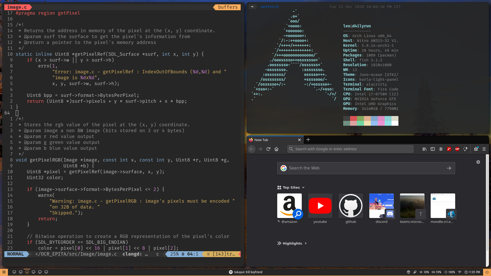
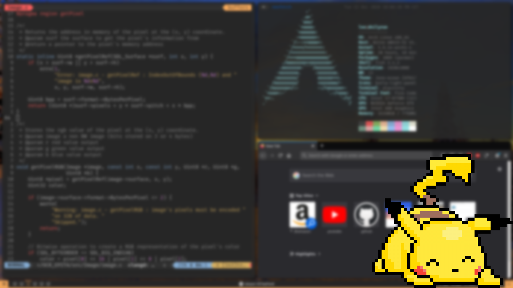

# My dofiles

## Requirements

### CLI

```
fish oh-my-fish neovim neovim-plug git htop pulseaudio
```

### GUI

```
i3 i3-gaps i3lock-fancy picom Alacritty Dunst polybar rofi  
```
### Fonts

[Nerd Fonts](https://www.nerdfonts.com/font-downloads)

```
FiraCode Font-Awesome siji-git ttf-unifont IPAPMincho
```

## Installing

`sh Install/install.sh`

When first installing yay helper press enter when the program seems to have stopped, it is just waiting for confirmation but isn't outputing it correctly.
Polybar usually takes some time to compile, just wait it's expected.

### Scripts

Just copy the scripts into `/usr/local/bin` and run `setup.sh` when possible.

## screenshots



